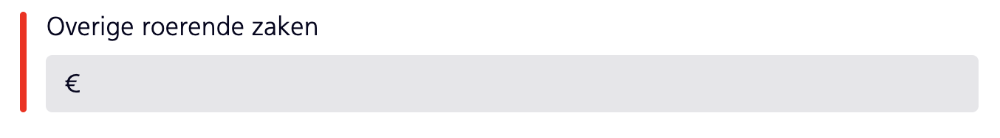
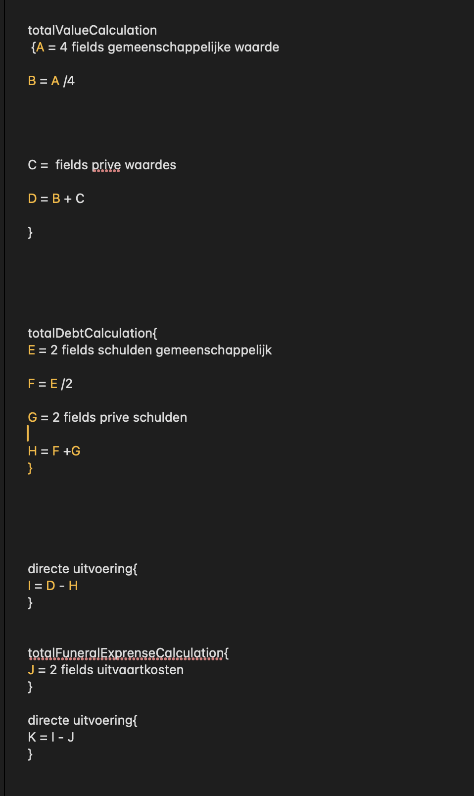

# Browser Tech

## Inhoudsopgave

- [Week 1](#week-1)
  - [Woensdag 26 Feb](#woensdag-26-feb)
  - [Donderdag 27 Feb](#donderdag-27-feb)
  - [Vrijdag 28 Feb](#vrijdag-28-feb)
- [Week 2](#week-2)
  - [Woensdag 5 Mar](#woensdag-5-mar)
  - [Donderdag 6 Mar](#donderdag-6-mar)
  - [Vrijdag 7 Mar](#vrijdag-7-mar)
- [Week 3](#week-3)
  - [Woensdag 12 Mar](#woensdag-12-mar)
  - [Donderdag 13 Mar](#donderdag-13-mar)
  - [Vrijdag 14 Mar](#vrijdag-14-mar)
- [Week 4](#week-4)
  - [Woensdag 19 Mar](#woensdag-19-mar)
  - [Donderdag 20 Mar](#donderdag-20-mar)
  - [Vrijdag 21 Mar](#vrijdag-21-mar)

## Week 1

### Woensdag 26 Feb

We begonnen met een browser tech oefenopdracht. Hiervoor werden er verschillende groepen gemaakt binnen de klas en elk van deze groepen had een ander onderwerp die ze moesten testen. Mijn groep had het onderwerp Content blockers & Ad blockers. Hierbij moesten we kijken wat dit zijn, hoe ze werken en wat de gevolgen kunnen zijn op een website.

Hieruit kwamen we tot de conclusie dat sommige websites niet beschikbaar zijn als een adblocker aanstaat, sommige website hebben meer wit ruimte waar de advertentie eerst stond en sommige websites hadden een dynamische layout waardoor het niet eens te merken was dat er een advertentie weg was. Daarnaast kan een adblocker ook invloed hebben op de werking vaan Google Analytics dus als dit niet goed wordt geschreven in de code, kan dit zorgen voor JavaScript errors.

Content blockers is eigenlijk een overkoepelende naam voor verschillende soorten blockers, zoals adblockers, maar ook geografische blockers waardoor alleen gebruikers uit een bepaalde regio een website kunnen bezoeken. Ook hebben grote bedrijven vaan een vorm van content blockers voor meer veiligheid. Het was erg interessant om dit allemaal uit te zoeken en ik heb nu een beter beeld van content en adblockers en de invloed daarvan op een website.

We zijn de dag geëindigd met presentaties over de bevindingen van alle groepjes, maar omdar we een weekly nerd hadden waren er een paar groepjes die pas de dag erna konden presenteren.

### Donderdag 27 Feb

We begonnen deze dag met de laatste presentaties van de introductie opdracht. Daarna kregen we een uitleg over de eindopdracht: Een NS Aangifte Erfbelasting website die het makkelijker maakt om dit lange formulier in te vullen en die robuust is, het moet dus op elk apparaat kunnen werken. Ik ben begonnen met de huisstijl van NS te verzamelen en in mijn CSS te zetten. Toen heb ik alvast wat basis CSS geschreven om zo de huisstijl van NS aan te houden.

Toen hebben we een workshop gehad van Krijn over de UX van HTML. Er zijn heel veel UX problemen waar je tegen aan kan lopen, maar als je een goede HTML schrijft geeft de browser je al een heleboel functionaliteiten die automatisch de UX verbeteren. Daarom is het schrijven van een solide HTML zo belangrijk voor het maken van een robuuste website. Deze workshop was erg interessant en ik heb meteen een aantal nieuwe dingen geleerd die ik kan toepassen bij de eindopdracht, zoals: HTML Patterns, input types die je kan customizen met attributen en meer.

### Vrijdag 28 Feb

Tijdens deze eerste feedback sessie zat ik met mijn groepje en Krijn. Hierbij lieten we ons werk zien en kregen we feedback. Daarnaast werden een paar vragen gesteld over wat we deze week hadden gedaan en wat onze plannen waren voor de eindopdracht (Welke delen we bijvoorbeeld willen maken en waarom). Ik kreeg te horen dat ik goed op weg was en dat mijn plan ook goed was dus dat ik daarmee verder kon gaan. Ik zelf wil ook graag de backend in duiken om zo dit formulier echt tot leven te laten komen, maar er werd aangeraden om mij eerst te richten op de HTML, CSS en Client-side JavaScript.

## Week 2

### Woensdag 5 Mar

Ik was helaas sinds dinsdag 4 Maart ziek geworden en heb geen werk kunnen doen.

### Donderdag 6 Mar

Ik was helaas sinds dinsdag 4 Maart ziek geworden en heb geen werk kunnen doen.

### Vrijdag 7 Mar

Ik was helaas sinds dinsdag 4 Maart ziek geworden en heb geen werk kunnen doen.

## Week 3

### Woensdag 12 Mar

Ik was helaas sinds dinsdag 4 Maart ziek geworden en heb geen werk kunnen doen.

### Donderdag 13 Mar

Ik heb vandaag de eerste test gedaan op oude devices en ik zag dat de werking van de website het over het algemeen goed deed, maar ik kwam erachter dat input[type="date"] bijvoorbeeld nog niet ondersteund werd, dus heb ik gezorgd dat ik in de label aangeef ik welk format ik de datum verwacht, zodat de gebruiken deze nog steeds correct uit kan voeren met een input[type="text"]. Het checken hiervan zou dan uiteraard gebeuren via server side code.

Ook had ik een feedback gesprek met Jeremy Keith die erg interessant was, en een goede tip die ik had gekregen was om te zorgen dat alles standaard zichtbaar is en dat je met JavaScript iets niet zichtbaar maakt als je het bijvoorbeeld wilt uitklappen. Zo zorg je ervoor dat als JS niet werkt, de gebruiker nog steeds alle belangrijke fields kan zien.

Ook heb ik bij de Initialen input gezorgd met JavaScript dat bij elke letter een punt erachter komt. Ik was erg tevreden met hoe dit eruit is gekomen!

### Vrijdag 14 Mar

Ik heb deze dag gewerkt aan de uitklap stukjes, waarvan 1 het erg goed doet, maar de andere werkt de eerste keer alleen als de pagina gerefreshed wordt, terwijl de code hetzelfde is. Ook deze bug heb ik helaas nog niet kunnen fixen.

## Week 4

### Woensdag 19 Mar

Ik heb deze dag de error messages gemaakt en de error state aangepast van een rode background color op de input naar dit:

Ook heb ik daarbij error messages gemaakt en samen ziet dat er zo uit:

Daarnaast heb ik mijn CSS structuur aangepast. Ik gebruikte nog best veel CSS Nesting, omdat dit er voor mij duidelijker uitziet, maar toen ik ging kijken op [caniuse.com](https://caniuse.com/css-nesting) zag ik dat vooral de oudere browsers nog geen support hadden hiervoor, dus heb ik alle CSS nesting weg gehaald

Ook heb ik een informatie stukje gemaakt die op hover tevoorschijn komt. Hier is wel een bug die ik heb gevonden. De hover werkt namelijk al op de parent, maar ik kan maar niet achterhalen waar dit aan ligt.

Daarnaast heb ik een erfenis bereking uitgewerkt. Dit heeft uiteindelijk 2 uur geduurd, maar het werkt en de bereking is als volgt:

